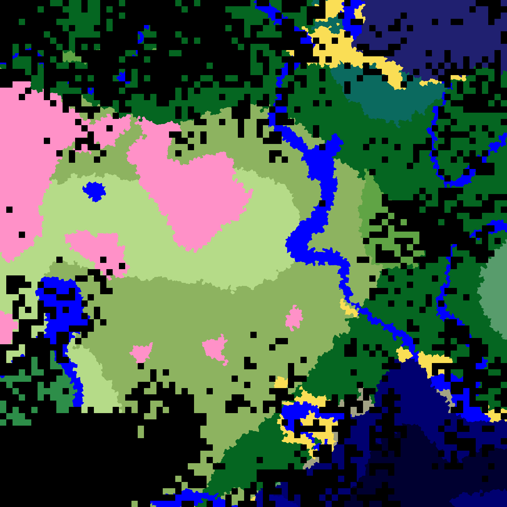

# Bedrock Level

Bedrock level library written in C++
(The project is still in the early demo stage and may contain some bugs)

Only on Mingw64!!!

## Samples

### Biome Map

```c++
int main() {
    bl::init_biome_color_palette_from_file(
        R"(C:\Users\xhy\dev\bedrock-level\data\colors\biome.json)");

    const std::string path = R"(C:\Users\xhy\Desktop\t)";
    bl::bedrock_level level;
    if (!level.open(path)) {
        fprintf(stderr, "Can not open level %s", path.c_str());
        return -1;
    }

    auto spawn_pos = level.dat().spawn_position();
    auto center_chunk_pos = spawn_pos.to_chunk_pos();
    const int DIM = 0;
    const int R = 40;
    auto minP = bl::chunk_pos{center_chunk_pos.x - R, center_chunk_pos.z - R, DIM};
    auto maxP = bl::chunk_pos{center_chunk_pos.x + R, center_chunk_pos.z + R, DIM};
    const int W = maxP.x - minP.x + 1;
    const int H = maxP.z - minP.z + 1;
    std::vector<std::vector<bl::color>> cm(H * 16, std::vector<bl::color>(W * 16, bl::color()));
    for (int x = minP.x; x <= maxP.x; x++) {
        for (int z = minP.z; z <= maxP.z; z++) {
            auto *chunk = level.get_chunk({x, z, DIM});
            if (chunk) {
                auto sx = (x - minP.x) * 16;
                auto sz = (z - minP.z) * 16;
                for (int xx = 0; xx < 16; xx++) {
                    for (int zz = 0; zz < 16; zz++) {
                        cm[sz + zz][sx + xx] = bl::get_biome_color(chunk->get_top_biome(xx, zz));
                    }
                }
            }
        }
    }
    bl::export_image(cm, 1, "biome.png");
    return 0;
}
```




### Complie guide

You just need to clone this repo and run `build.ps1` in powershell